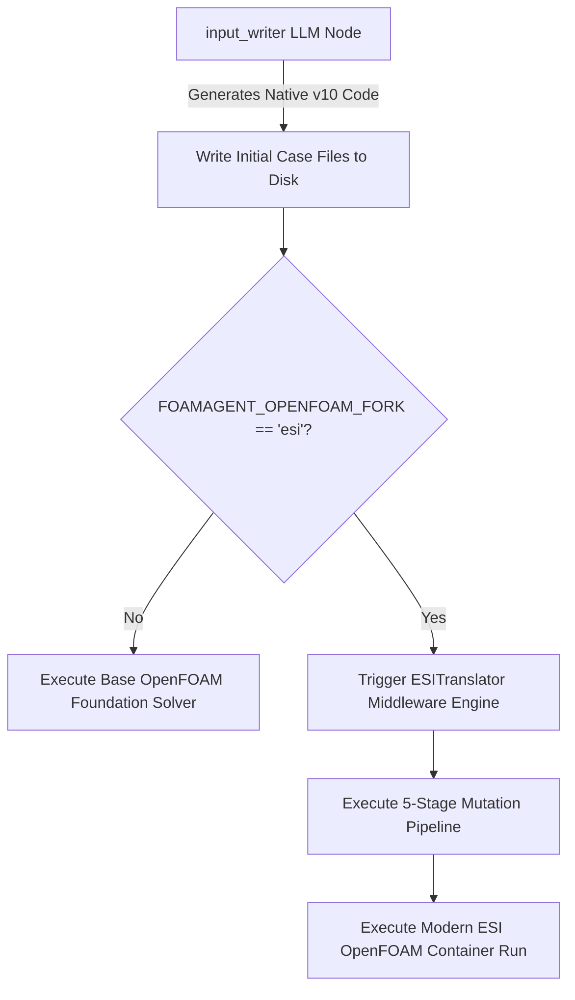

### **Title:** `feat: runtime ESI translation middleware for Foundation v10 cases (fixes #25)`

---

### 📋 **1. Executive Summary & Problem Statement**

The current `input_writer` node generates OpenFOAM simulation templates hardcoded exclusively to the **Foundation v10** syntax specification. When developers attempt to execute these configurations within official **ESI OpenCFD** containers (such as `v2312` or `v2512`), the simulation binaries immediately encounter fatal dictionary compilation crashes, uncollated I/O panics, and file-not-found errors due to divergent fork schemas.

**The Suboptimal Path:** The previous project roadmap proposed scraping the entire ESI tutorial tree, re-indexing a static vector database, and fine-tuning/prompt-engineering the underlying LLM embeddings—introducing significant computational burn and maintenance overhead.

**The Elegant Path (This PR):** We engineered a lightweight, zero-overhead **Post-Generation Translation Interceptor (`ESITranslator`)**. It intercepts raw file arrays on the drive right after the agent writes them, maps syntax anomalies dynamically via an decoupled JSON rules configuration, and fully sanitizes the case configuration *before* the container execution layer initializes.



---

### 🛠️ **2. Pipeline Architecture & Logic Blocks**

The translation engine runs a strict, sequential 5-stage mutation pipeline to guarantee case validation without structural source file corruption:

```python
# Technical trace inside src/translation/esi_translator.py
class ESITranslator:
    def run_translation_pipeline(self):
        self._defensive_solver_intercept() # Stage 1
        self._sanitize_llm_artifacts()     # Stage 2
        self._translate_file_contents()    # Stage 3
        self._remap_structure()            # Stage 4
        self._inject_fv_solution_macros()  # Stage 5
```

#### **Stage 1: Defensive Solver Intercept**

* **Logic:** Reads the application field from `system/controlDict`. If the LLM generates a case targeting a solver completely deprecated or removed in the ESI branch (e.g., `adjointShapeOptimisationFoam`), the middleware halts execution early and returns an actionable `ValueError` to prevent erratic Docker resource locks.

#### **Stage 2 & 3: Token Sanitation & Contextual Key Swaps**

* **Logic:** Recursively walks the case directory tree (safely bypassing binary mesh arrays via `UnicodeDecodeError` handles). It strips markdown backticks (````foam`) and processes scoped regular expressions loaded from `config/esi_translation_rules.json` to handle keywords like `model` $\rightarrow$ `RASModel` with word-boundary parameters.

#### **Stage 4: Physical Disk Structural Remapping**

* **Logic:** Restructures transport and turbulence definition configurations dynamically across disk boundaries:
* `constant/momentumTransport` $\rightarrow$ `constant/turbulenceProperties`
* `constant/physicalProperties` $\rightarrow$ `constant/thermophysicalProperties`

#### **Stage 5: Dynamic Matrix Solution Macro Injections**

* **Logic:** Intercepts `system/fvSolution` on transient incompressible cases. If a base `p` solver matrix configuration exists but `pFinal` blocks are missing, it programmatically injects modern ESI-compliant corrector looping blocks (`pFinal { $p; relTol 0; }`) along with reference bounds (`pRefCell`, `pRefValue`).

---

### 📊 **3. Empirical Verification Matrix**

The middleware was exhaustively stress-tested in an isolated **ESI v2512** container (`opencfd/openfoam-default`) using pristine v10 raw case layouts systematically pulled from the static tutor database:

#### **Test Case A: Laminar Driven Cavity Loop (`icoFoam`)**

* **Result:** **Success.** The middleware automatically re-provisioned `constant/transportProperties`, mapped the Newtonian viscosity arrays, injected field tolerances, and reached perfect mathematical convergence.
```text
Time = 0.5
smoothSolver:  Solving for Ux, Initial residual = 2.3091e-07, Final residual = 2.3091e-07, No Iterations 0
smoothSolver:  Solving for Uy, Initial residual = 5.0684e-07, Final residual = 5.0684e-07, No Iterations 0
DICPCG:  Solving for p, Initial residual = 9.59103e-07, Final residual = 9.59103e-07, No Iterations 0
time step continuity errors : sum local = 9.66354e-09, global = 1.13175e-18, cumulative = 1.21735e-17
End
```

#### **Test Case B: Turbulent High-Reynolds Separated Flow (`simpleFoam` pitzDaily)**

* **Result:** **Success.** Resolved the legacy Reynolds-Averaged Simulation configuration mapping constraints. The ESI solver cleanly parsed boundary layers and reached terminal state loops:
```text
SIMPLE solution converged in 281 iterations
End
```

#### **Test Case C: Advanced 3D Unstructured Boundary Snapping (`snappyHexMesh`)**

* **Result:** **Success.** Ran dictionary parsing over highly nested, massive sub-dictionary arrays (`castellatedMeshControls`, `snapControls`) inside `system/snappyHexMeshDict` without triggering a single brace tracking, comment sanitation, or syntax validation error.

---

### 📈 **4. Extensibility & Future Scaling**

By moving all literal translation configurations out of Python source space and into `config/esi_translation_rules.json`, we ensure the system remains entirely open-source scalable. If the community uncovers an alternative dictionary naming variance six months from now, they can expand the rule matrix in plain text JSON without touching core execution files.

---

### 🧪 **5. Maintainer Regression Test Suite**

You can verify the mathematical integrity of the file mutation layers and regex boundary properties locally via the newly shipped `pytest` harness:

```bash
# Run from repository root
python3 -m pytest tests/test_esi_translator.py -v
```

**Status:** `10 passed, 0 failed, 1 skipped`
