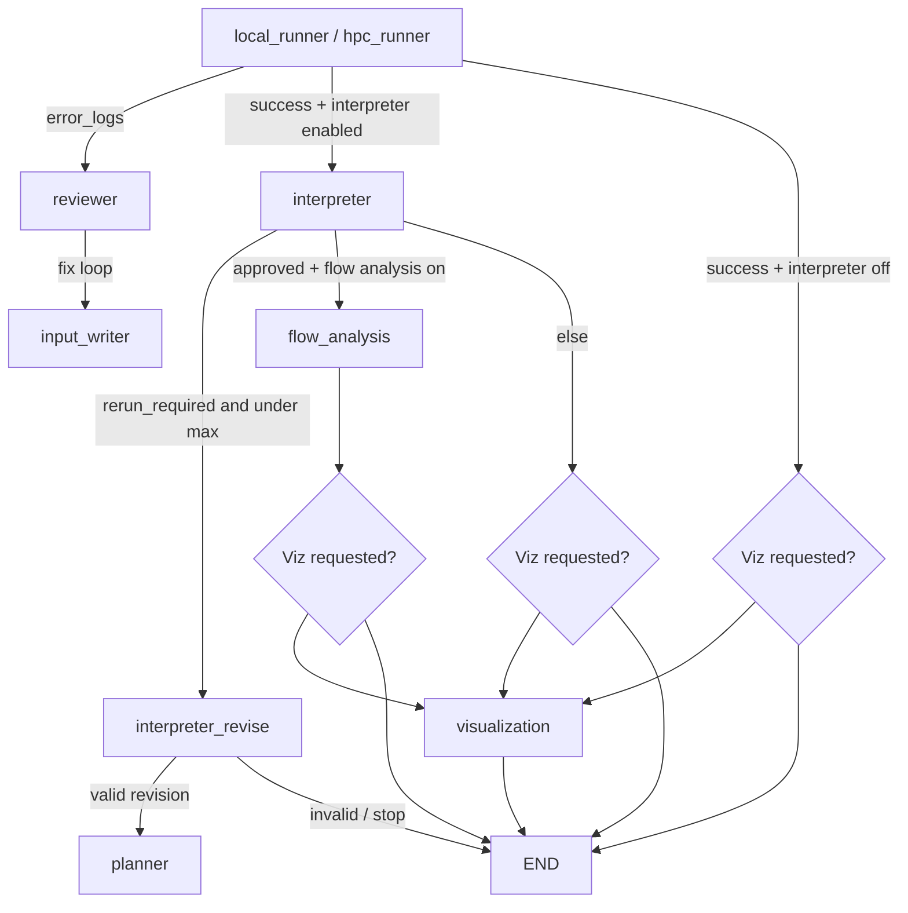

# Post-run interpreter, visualization creator, and flow-field analysis

This note summarizes what was added to Foam-Agent around **automated result checking** and **narrative flow-field analysis**, adapted from patterns in the sibling **cfd-scientist** project.

## High-level workflow

After the OpenFOAM run completes **without runner errors** (local or HPC), the graph can enter a post-processing chain before optional user-requested visualization and `END`.

**Order in practice**

1. **Planner → meshing (optional) → input_writer → runner**
2. On **runner errors**: **reviewer** ↔ **input_writer** (up to `config.max_loop`)
3. On **runner success** and `enable_post_run_interpreter`: **interpreter**
4. From **interpreter**:
   - If `rerun_required` and `interpreter_rerun_count < interpreter_max_reruns` (default 10): **interpreter_revise** → **planner** (full replan; case dir recreated by planner)
   - Else if interpreter is considered **approved** and `enable_flow_field_analysis`: **flow_analysis**
   - Else: optional **visualization** (only if the user explicitly asked for viz in the natural-language requirement) → **END**
5. From **flow_analysis**: same optional **visualization** → **END**

The existing **visualization** node (minimal PyVista screenshot) is separate from interpreter/analysis viz; it only runs when the user’s prompt explicitly requests visualization.

---

## What was added (by component)

### 1. `viz_creator` (`src/interpreter/viz_creator.py`)

- **Role:** Asks a vision-capable LLM to emit a **PyVista** Python script, runs it in the case directory, checks PNG outputs with a small **VLM JSON check**, and retries on failure.
- **Outputs:** PNGs and `viz_script.py` under the chosen output folder (e.g. `interpreter_viz/` or `analysis_viz/`).
- **Origin:** Same idea as cfd-scientist’s central `viz_creator`; integrated here with an **injected LangChain chat model** (`llm`) instead of a raw model name, so it uses Foam-Agent’s interpreter LLM factory.

### 2. Results interpreter (`src/interpreter/interpreter_agent.py`, `src/nodes/interpreter_node.py`)

- **Role:** After a successful solve, decides **whether the case matches the user requirement** using:
  - Case layout (time dirs, fields),
  - **`viz_creator`** figures under `<case_dir>/interpreter_viz/`,
  - A **vision LLM** pass with prompts from `src/interpreter/prompts_results_interpreter.json`.
- **Key state:** `interpreter_report` (e.g. `rerun_required`, `requirement_met`, `simulation_success`, `viz_ok`, …).
- **Artifact:** `<case_dir>/interpreter_report.json`

### 3. Interpreter rerun loop (`src/interpreter/rerun_requirement.py`, `src/nodes/interpreter_revise_node.py`)

- **Role:** If the interpreter sets `rerun_required`, an LLM **revises the user requirement** from interpreter feedback (no visualization fluff), then the workflow returns to **planner** for a full rerun.
- **Limits:** `config.interpreter_max_reruns` (default **10**), env `FOAMAGENT_INTERPRETER_MAX_RERUNS`.
- **State:** `interpreter_rerun_count`, `interpreter_requirement_updates`; flow-analysis fields are cleared on a successful revise so stale analysis is not kept.

### 4. Flow-field analysis agent (`src/interpreter/flow_analysis_agent.py`, `src/nodes/flow_analysis_node.py`)

- **Role:** Runs **only when the interpreter outcome is treated as approved** (see `router_func._interpreter_approved_for_analysis`).
- **Steps:**
  1. LLM proposes a **visualization spec** for explaining the flow.
  2. **`viz_creator`** again, under `<case_dir>/analysis_viz/`, optionally seeding from `interpreter_viz/viz_script.py` if present.
  3. **Vision LLM** writes a **user-facing narrative** of the flow field and features.
- **Artifacts:** `flow_analysis_report.md` (narrative + viz spec section), `flow_analysis_bundle.json`.

### 5. Interpreter LLM wiring (`src/interpreter/llm_factory.py`)

- Builds a **LangChain** chat model aligned with `config` (OpenAI, Anthropic, Bedrock, Ollama).
- For **`openai-codex`**, the main Codex Responses wrapper is **not** used here; a **platform OpenAI** model with **`OPENAI_API_KEY`** is required for vision (see config / error message). Optional overrides: `interpreter_model_version`, env `FOAMAGENT_INTERPRETER_MODEL_VERSION` / `FOAMAGENT_INTERPRETER_MODEL`.

### 6. Graph and routing (`src/main.py`, `src/router_func.py`)

- New nodes: `interpreter`, `interpreter_revise`, `flow_analysis`.
- New routes: `route_after_interpreter`, `route_after_interpreter_revise`, `route_after_flow_analysis`.

### 7. Config and state (`src/config.py`, `src/utils.py` `GraphState`, `initialize_state` in `src/main.py`)

| Setting | Default | Env override (examples) |
|--------|---------|-------------------------|
| Post-run interpreter | `True` | `FOAMAGENT_ENABLE_INTERPRETER` |
| Max interpreter reruns | `10` | `FOAMAGENT_INTERPRETER_MAX_RERUNS` |
| Interpreter model | uses `model_version` if `interpreter_model_version` empty | `FOAMAGENT_INTERPRETER_MODEL_VERSION` |
| Flow-field analysis after approval | `True` | `FOAMAGENT_ENABLE_FLOW_ANALYSIS` |

State keys include: `interpreter_report`, `interpreter_rerun_count`, `interpreter_requirement_updates`, `interpreter_revise_applied`, `flow_analysis_text`, `flow_analysis_bundle`.

---

## Headless systems and graphics (important)

Interpreter and flow analysis rely on **PyVista** (and **VTK**) generating images **off-screen** (`off_screen=True` in generated scripts). On servers **without a display** or with minimal OpenGL stacks, you may need **extra OS libraries** or a virtual framebuffer; missing libs often show up as VTK/PyVista errors or blank crashes.

Typical considerations:

- **Linux (Docker / CI / cloud):** install Mesa / GL software stack packages for your distro (names vary: e.g. `libgl1-mesa-glx`, `libosmesa6-dev`, or vendor-specific EGL/OSMesa packages). Some teams run under **`xvfb-run`** for compatibility.
- **Python:** keep **`pyvista`**, **`vtk`**, and **`matplotlib`** consistent with the project environment (`environment.yml`).
- **Optional:** **`Pillow`** (`PIL`) is used in the flow analysis path to downscale images for some API limits; install if missing.

If visualization fails only on headless machines, treat it as an **environment** issue first (GL/OSMesa/Xvfb), then check PyVista/VTK versions.

---

## Disabling features

- Turn off the whole post-run interpreter chain: set `enable_post_run_interpreter=False` or `FOAMAGENT_ENABLE_INTERPRETER=0`.
- Keep interpreter but skip the second analysis pass: set `enable_flow_field_analysis=False` or `FOAMAGENT_ENABLE_FLOW_ANALYSIS=0`.
